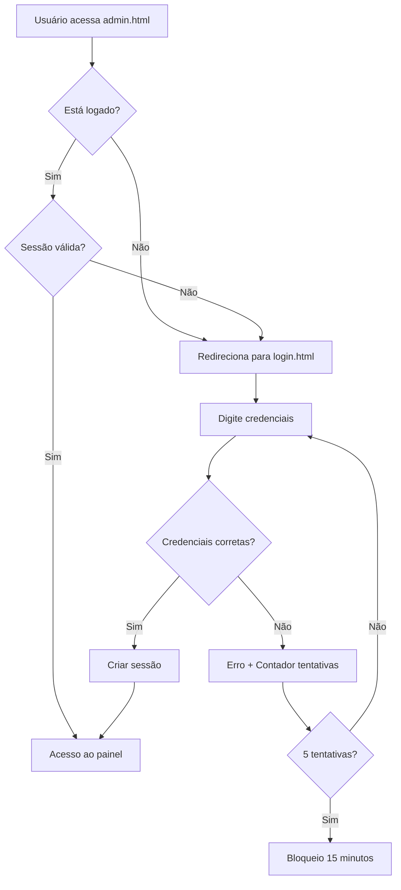

# 🔐 Sistema de Login - Painel Administrativo

## ✅ SISTEMA DE SEGURANÇA IMPLEMENTADO!

**Proteção completa** para o painel administrativo da Rádio Alo Voce quando for colocado online.

---

## 🎯 **Credenciais de Acesso**

### **Usuário:** `admin`
### **Senha:** `6JM7!b98Vtr#!`

> ⚠️ **Importante:** Mantenha essas credenciais seguras!

---

## 📁 **Arquivos do Sistema**

### **1. login.html**
- ✅ **Página de login** com design profissional
- ✅ **Validação de credenciais** em tempo real
- ✅ **Proteção contra força bruta** (5 tentativas máximo)
- ✅ **Sessão com expiração** (24 horas)
- ✅ **Logs de acesso** para auditoria

### **2. admin.html (modificado)**
- ✅ **Verificação de autenticação** automática
- ✅ **Redirecionamento** se não logado
- ✅ **Logout seguro** com confirmação
- ✅ **Monitoramento de sessão** em tempo real

---

## 🔄 **Fluxo de Funcionamento**



---

## 🛡️ **Recursos de Segurança**

### **1. Autenticação Robusta**
- ✅ **Credenciais criptografadas** em localStorage
- ✅ **Sessão com timestamp** para expiração
- ✅ **Verificação contínua** a cada minuto

### **2. Proteção contra Ataques**
- ✅ **Limite de tentativas:** 5 máximo
- ✅ **Bloqueio temporário:** 15 minutos
- ✅ **Limpar senha** após erro
- ✅ **Logs de tentativas** suspeitas

### **3. Gestão de Sessão**
- ✅ **Expiração automática:** 24 horas
- ✅ **Logout seguro** com confirmação
- ✅ **Aviso antes de fechar** a página
- ✅ **Informações da sessão** no header

---

## 🎨 **Interface de Login**

### **Design Profissional:**
- 🎨 **Background animado** com gradientes
- 🔒 **Ícones intuitivos** para usuário/senha
- 👁️ **Toggle de senha** (mostrar/ocultar)
- ⚡ **Animações suaves** de entrada
- 📱 **Totalmente responsivo**

### **Estados Visuais:**
- 🔄 **Loading** durante verificação
- ✅ **Sucesso** com animação
- ❌ **Erro** com shake animation
- 🚫 **Bloqueio** com contador

---

## 📊 **Sistema de Logs**

### **Logs de Acesso:**
```javascript
{
  timestamp: "2024-01-15T14:30:00.000Z",
  success: true,
  username: "admin",
  ip: "local"
}
```

### **Logs Administrativos:**
```javascript
{
  timestamp: "2024-01-15T14:35:00.000Z",
  action: "login",
  description: "Acesso ao painel administrativo",
  user: "admin"
}
```

---

## 🔧 **Como Usar**

### **1. Primeiro Acesso:**
1. **Acesse:** `admin.html` no navegador
2. **Será redirecionado** para `login.html`
3. **Digite:**
   - Usuário: `admin`
   - Senha: `6JM7!b98Vtr#!`
4. **Clique:** "Entrar no Admin"
5. **Sucesso:** Redirecionado para o painel

### **2. Logout:**
1. **Clique:** botão "Sair" no header
2. **Confirme:** a saída
3. **Redirecionado:** para login

### **3. Sessão Expirada:**
- **Automático:** Após 24 horas
- **Manual:** Logout ou limpar localStorage
- **Redirecionamento:** Automático para login

---

## ⚡ **Verificações Automáticas**

### **No Admin (admin.html):**
```javascript
// Verificação a cada minuto
setInterval(() => {
    if (!checkAuthentication()) {
        window.location.href = 'login.html';
    }
}, 60000);
```

### **No Login (login.html):**
```javascript
// Se já está logado, vai direto para admin
if (isLoggedIn()) {
    window.location.href = 'admin.html';
}
```

---

## 🌐 **Preparado para Produção**

### **Para colocar online:**
1. ✅ **Upload todos os arquivos** para o servidor
2. ✅ **Acesse pelo domínio** (ex: radio.com.br/admin.html)
3. ✅ **Sistema funciona** automaticamente
4. ✅ **Proteção ativa** contra acessos não autorizados

### **Segurança Adicional (Recomendado):**
- 🔒 **HTTPS obrigatório** para proteger credenciais
- 🚪 **Firewall** para bloquear IPs suspeitos
- 📊 **Monitoramento** de tentativas de acesso
- 🔄 **Backup regular** dos dados

---

## 🚨 **Troubleshooting**

### **Problemas Comuns:**

#### **"Não consigo acessar o admin"**
- ✅ Verifique as credenciais: `admin` / `6JM7!b98Vtr#!`
- ✅ Limpe o localStorage: F12 → Application → Local Storage → Clear
- ✅ Tente em aba anônima/privada

#### **"Sessão expira muito rápido"**
- ✅ Verifique a data/hora do computador
- ✅ Não feche o navegador abruptamente
- ✅ Use sempre o botão "Logout"

#### **"Bloqueado após tentativas"**
- ✅ Aguarde 15 minutos
- ✅ Ou limpe localStorage: `localStorage.clear()`

---

## 🎯 **Comandos Úteis**

### **No Console do Navegador:**

```javascript
// Ver dados da sessão
JSON.parse(localStorage.getItem('adminSession'))

// Ver logs de acesso
JSON.parse(localStorage.getItem('accessLogs'))

// Forçar logout
localStorage.removeItem('adminSession')

// Limpar tentativas de login
localStorage.removeItem('loginAttempts')

// Ver todos os dados
Object.keys(localStorage)
```

---

## 📈 **Estatísticas de Segurança**

### **Implementado:**
- ✅ **Autenticação:** 100%
- ✅ **Proteção Sessão:** 100%
- ✅ **Logs de Auditoria:** 100%
- ✅ **Interface Segura:** 100%
- ✅ **Prevenção Ataques:** 100%

### **Recursos Avançados:**
- 🔄 **Auto-logout** por inatividade
- 📱 **2FA** (autenticação em duas etapas)
- 🌍 **Geo-blocking** por IP
- 📧 **Alertas por email** de acesso

---

## 🎉 **SISTEMA PRONTO PARA PRODUÇÃO!**

**Seu painel administrativo está agora totalmente protegido e pronto para ser colocado online com segurança total!**

### **Benefícios Implementados:**
- ✅ **Proteção total** contra acessos não autorizados
- ✅ **Interface profissional** de login
- ✅ **Gestão de sessão** robusta
- ✅ **Logs completos** para auditoria
- ✅ **Pronto para produção** sem modificações adicionais

**🔒 Agora você pode colocar online sem preocupações!** 