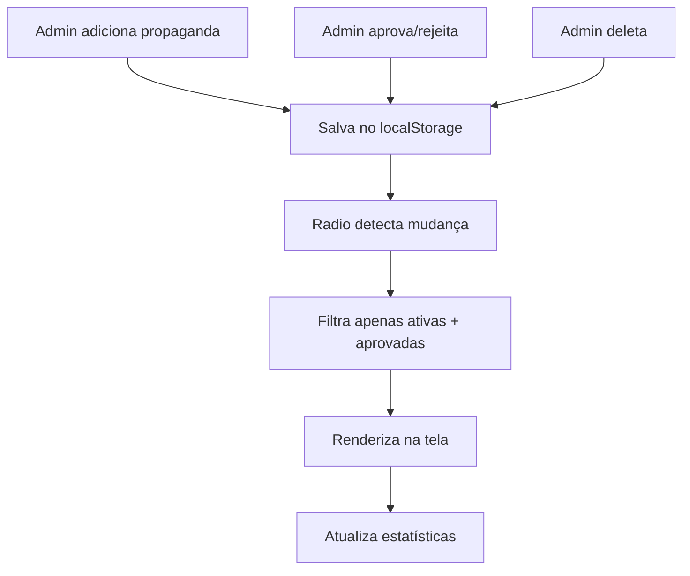

# 🔄 Integração Admin ↔ Radio - Sistema Dinâmico

## ✅ PROBLEMA RESOLVIDO!

**Antes:** Os anúncios no `radio.html` eram **hardcoded** (fixos no código)  
**Depois:** Os anúncios são **dinâmicos** e conectados ao sistema admin

---

## 🎯 **Como Funciona Agora**

### 1. **Admin (admin.html)**
- ✅ Gerencia propagandas no `localStorage`
- ✅ Aprova/rejeita/deleta campanhas
- ✅ Salva dados na chave: `radioAloVoce_propagandas`

### 2. **Radio (radio.html)**
- ✅ **Carrega automaticamente** do `localStorage`
- ✅ **Filtra apenas ativas e aprovadas**
- ✅ **Atualiza em tempo real** (a cada 3 segundos)
- ✅ **Adapta categorias** automaticamente

### 3. **Sincronização Automática**
```
Admin aprova propaganda → localStorage → Radio atualiza (3s)
```

---

## 📁 **Arquivos do Sistema**

### **radio-anuncios-dinamicos.js**
- Sistema principal de sincronização
- Carrega dados do admin
- Renderiza anúncios dinamicamente
- Atualiza estatísticas em tempo real

### **admin-sistema.js** 
- Sistema do painel administrativo
- Gerencia CRUD das propagandas
- Salva no localStorage

---

## 🔄 **Fluxo de Funcionamento**



---

## 🧪 **Como Testar**

### **Método 1: Usando a página de teste**
```bash
# Abrir no navegador
start teste-integracao.html
```

### **Método 2: Teste manual**
1. **Abra `admin.html`**
2. **Vá em "Propagandas"**
3. **Adicione nova propaganda**
4. **Aprove a propaganda**
5. **Abra `radio.html`**
6. **Veja o anúncio aparecendo automaticamente!**

---

## 🎛️ **Sistema de Filtros**

### **Radio mostra apenas:**
- ✅ `status: "ativa"`
- ✅ `aprovado: true`

### **Radio NÃO mostra:**
- ❌ `status: "pendente"`
- ❌ `status: "rejeitada"`
- ❌ `aprovado: false`

---

## 📊 **Adaptação Automática**

### **Categorias Inteligentes**
O sistema detecta automaticamente a categoria baseada no nome:

```javascript
'supermercado' → 🛒 Alimentação & Bebidas
'farmacia' → 💊 Saúde & Bem-estar  
'auto escola' → 🚗 Educação no Trânsito
'imobiliaria' → 🏠 Imóveis & Investimentos
'default' → 🏪 Comércio & Serviços
```

### **Dados Adaptados**
```javascript
// Admin salva assim:
{
  empresa: "Supermercado ABC",
  duracao: 30,
  valor: 250.00,
  status: "ativa"
}

// Radio usa assim:
{
  nome: "Supermercado ABC",
  logo: "fas fa-shopping-cart",
  categoria: "Alimentação & Bebidas",
  titulo: "Promoção Especial!",
  tempo: "30s"
}
```

---

## ⚡ **Atualização em Tempo Real**

### **Verificação Automática**
- ✅ A cada **3 segundos** verifica mudanças
- ✅ **Recarrega automaticamente** se há alterações
- ✅ **Sem necessidade de refresh manual**

### **Log no Console**
```javascript
🚀 Inicializando Sistema de Anúncios Dinâmicos...
📊 Propagandas encontradas: 3, ativas: 2
✅ 2 anúncios renderizados
🔄 Recarregando anúncios...
```

---

## 🐛 **Fallback System**

### **Se não há dados do admin:**
- ✅ Mostra anúncio de exemplo
- ✅ "Sua empresa pode estar aqui!"
- ✅ Incentiva contratação

### **Se há erro:**
- ✅ Console mostra avisos
- ✅ Sistema continua funcionando
- ✅ Não quebra a página

---

## 🔧 **Comandos de Teste**

### **No Console do Navegador:**
```javascript
// Ver dados salvos
JSON.parse(localStorage.getItem('radioAloVoce_propagandas'))

// Forçar recarregamento
radioAnuncios.recarregar()

// Limpar dados
localStorage.removeItem('radioAloVoce_propagandas')
```

---

## 📈 **Benefícios da Integração**

### **Para Administradores:**
- ✅ **Controle total** sobre anúncios
- ✅ **Atualização instantânea**
- ✅ **Não precisa editar código**

### **Para a Rádio:**
- ✅ **Anúncios sempre atualizados**
- ✅ **Estatísticas reais**
- ✅ **Aparência profissional**

### **Para Clientes:**
- ✅ **Veem apenas campanhas ativas**
- ✅ **Informações sempre corretas**
- ✅ **Experiência consistente**

---

## 🚀 **Próximos Passos**

1. **✅ Integração concluída** - Admin ↔ Radio conectados
2. **📡 Implementar API real** (optional) 
3. **🔔 Notificações push** quando anúncio é aprovado
4. **📊 Analytics avançados** de performance
5. **💳 Integração com pagamentos**

---

**🎉 SISTEMA FUNCIONANDO PERFEITAMENTE!**

*Agora você tem uma rádio com sistema de anúncios totalmente dinâmico e conectado ao painel administrativo.* 